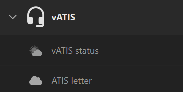
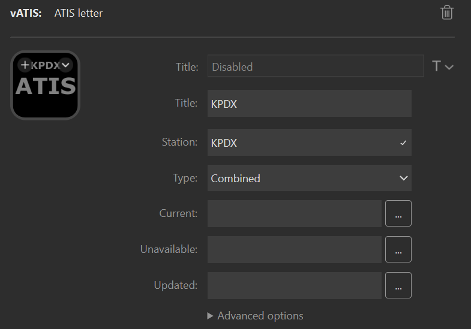
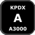
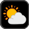
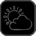

# vATIS actions for Stream Deck <!-- omit from toc -->

This Stream Deck plugin provides actions to interact with [vATIS](https://vatis.app/) running on your local machine.
[Download the plugin from the releases page](https://github.com/neilenns/streamdeck-vatis/releases/latest).

Do you use TrackAudio when controlling? Check out the companion [Stream Deck actions for TrackAudio](https://marketplace.elgato.com/product/trackaudio-e913a0ca-4c12-411d-a5a6-acf5f6c4bdea).

## Action descriptions

| Action       | Description                                                          |
| ------------ | -------------------------------------------------------------------- |
| ATIS letter  | Shows the current ATIS letter and altimeter for a specific station.  |
| vATIS status | Shows the current state of the connection to vATIS from Stream Deck. |

After installation the plugin actions are available under the vATIS category:

## Configuring an ATIS letter action

The ATIS letter action displays the station name, current AITS letter, and current altimeter
for a single station in vATIS.

Pressing the action will clear the new ATIS indicator in vATIS and on the action. A long
press of the action will refresh the action's state.

For example, if you have published a combined ATIS at KLMT in vATIS you can configure an action
like this to display the information on your Stream Deck:

### ATIS letter settings <!-- omit from toc -->

| Setting     | Description                                                               | Default                                                                              |
| ----------- | ------------------------------------------------------------------------- | ------------------------------------------------------------------------------------ |
| Title       | The title to show on the action. Optional.                                | Blank                                                                                |
| Station     | The name of the station you want to display status for. Required.         |                                                                                      |
| Type        | The type of the station.                                                  | Combined                                                                             |
| Current     | The image to display when the ATIS letter shown is current. Optional.     |                       |
| Unavailable | The iamge to display when there is no connection to vATIS. Optional.      |  |
| Updated     | The image to display when the ATIS letter updated to a new one. Optional. |                        |

The default display automatically includes the station name, ATIS letter, and altimeter. When specifying
custom images the following advanced settings can be used to display text on the action:

| Setting        | Description                        | Default |
| -------------- | ---------------------------------- | ------- |
| Show altimeter | Shows the altimeter on the action. | false   |
| Show letter    | Shows the letter on the action.    | false   |
| Show title     | Shows the title on the action.     | false   |
| Show wind      | Shows the wind on the action.      | false   |

## Configuring a vATIS status action

The vATIS status action shows the status of the connection between Stream Deck and vATIS.
A long press of the action will force a refresh of all the Stream Deck vATIS actions.

## TrackAudio status action settings <!-- omit from toc -->

| Setting       | Description                                                 | Default                                                                                 |
| ------------- | ----------------------------------------------------------- | --------------------------------------------------------------------------------------- |
| Title         | The title to show on the action. Optional.                  | Blank                                                                                   |
| Connected     | The image to display when connected to vATIS. Optional.     |         |
| Not connected | The image to display when not connected to vATIS. Optional. |  |
| Show title    | Shows the title on the action.                              | false                                                                                   |

## SVG templates

All image properties support SVG templates using [Handlebars](https://handlebarsjs.com/). This enables using a single SVG image across multiple
actions that respond to state changes.
