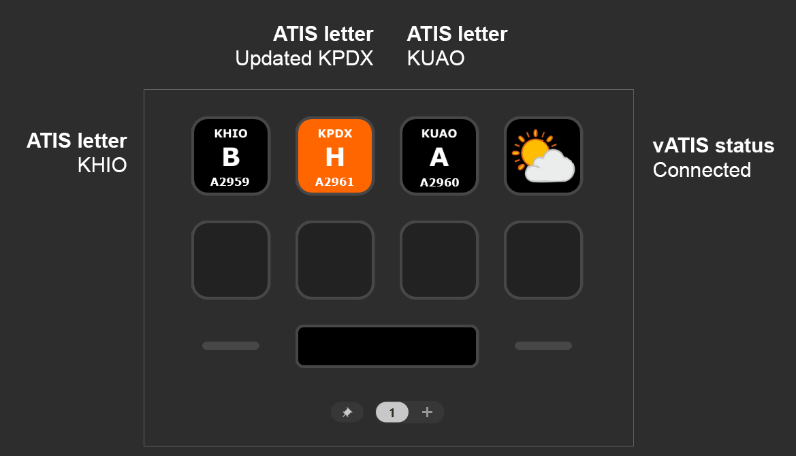

# vATIS actions for Stream Deck <!-- omit from toc -->

> [!IMPORTANT]
> This plugin requires [vATIS v4.1.0-beta.4](https://vatis.app/) or later.

This Stream Deck plugin provides actions to interact with [vATIS](https://vatis.app/) running on your local machine.
[Download the plugin from the releases page](https://github.com/neilenns/streamdeck-vatis/releases/latest).

[Read the documentation](https://projects.neilenns.com/docs/streamdeck-vatis) for information on how to set up actions and examples of common configurations.

Do you use TrackAudio when controlling? Check out the companion [Stream Deck actions for TrackAudio](https://marketplace.elgato.com/product/trackaudio-e913a0ca-4c12-411d-a5a6-acf5f6c4bdea).
